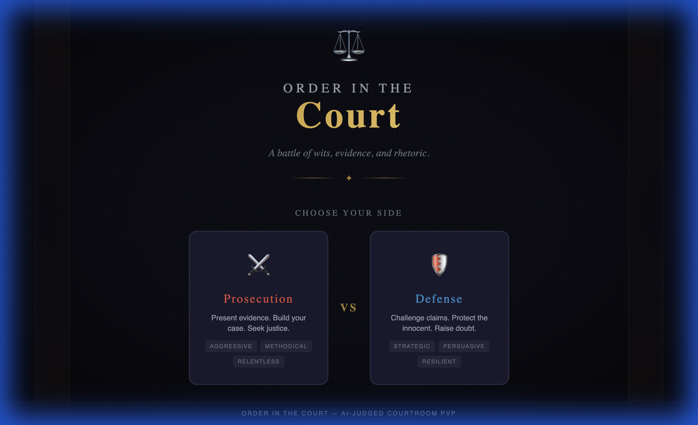
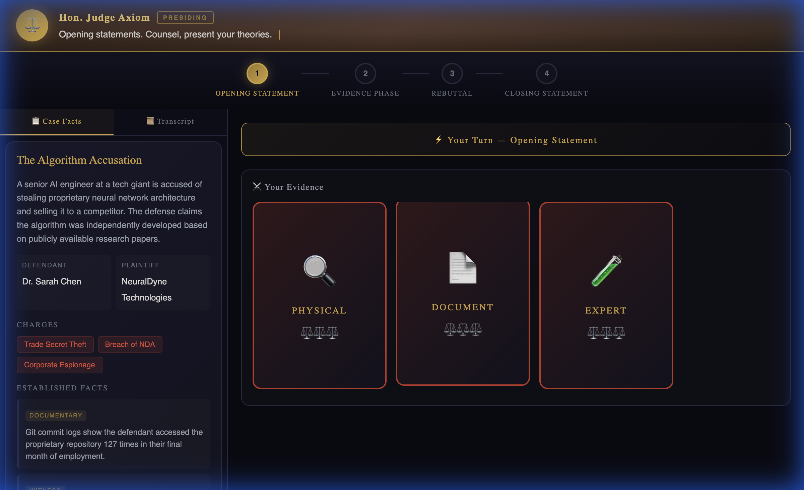
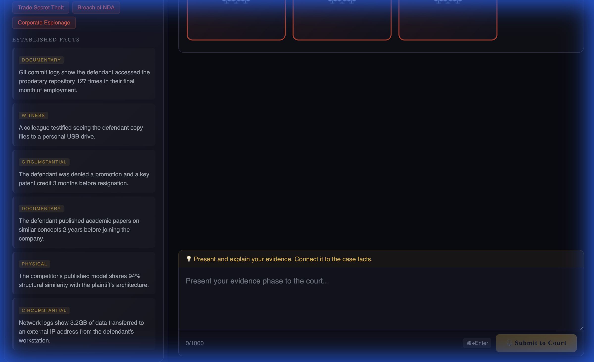
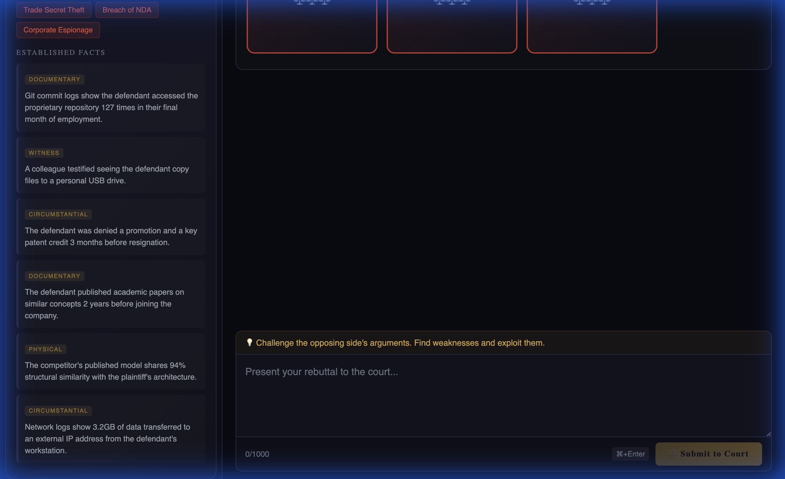
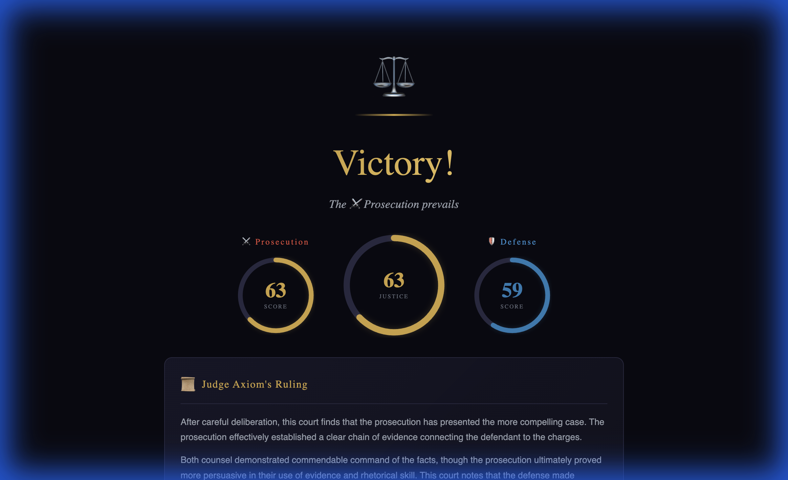

# Legal wars

# ⚖️ Order in the Court

A web-based, multiplayer PvP courtroom debate game. Two players — **Prosecution** vs **Defense** — compete in a turn-based legal showdown, judged by an AI with wit, wisdom, and zero tolerance for bad arguments.

Built with **Tempo**, **Privy**, and **Bun**.

---

## 📸 Screenshots

### Lobby — Choose Your Side

Pick your role: Prosecution or Defense. Each side has unique evidence cards and strategic advantages.

### Courtroom — Opening Statement

The main courtroom features:
- **Judge Banner** — Hon. Judge Axiom presides with typewriter-style announcements
- **Phase Indicator** — Visual 4-step progress through the trial
- **Case Facts Sidebar** — Defendant, plaintiff, charges, and established facts
- **Evidence Cards** — 3 flippable cards per player with strength ratings
- **Argument Input** — Phase-specific hints, character counter, keyboard shortcuts

### Courtroom — Evidence Phase

Present your evidence cards strategically. Each card has a type (Document, Testimony, Physical, Expert) and a strength rating.

### Courtroom — Rebuttal Phase

Challenge the opposing counsel's arguments. The transcript panel tracks every argument made.

### Verdict — Justice Score

Judge Axiom delivers the verdict with:
- **Animated Score Gauges** — Prosecution vs Defense scores + overall Justice Score (0–100)
- **Detailed Ruling** — Multi-paragraph analysis from the Judge
- **Performance Breakdown** — Legal Logic, Evidence Usage, and Persuasion scores
- **Notable Moments** — Highlighted quotes with witty commentary

---

## 🏗️ Architecture

## 🎯 Game Mechanics

### The Case
A random legal scenario is generated at game start. Three sample cases are included:
- **The Vanishing Vintage** — Wine theft at an auction house
- **The Algorithm Accusation** — AI trade secret theft
- **The Midnight Baker** — Underground poker ring

### Evidence Cards
Each player receives **3 unique Evidence Cards** with:
- **Type**: Document, Testimony, Physical, or Expert
- **Strength**: 1–3 (⚖️ scale)
- Cards can be flipped to reveal details and played during the Evidence Phase

### Turn Structure

| Phase | Description |
|-------|-------------|
| 1. Opening Statement | Present your theory of the case |
| 2. Evidence Phase | Play evidence cards and explain their relevance |
| 3. Closing Statement | Make your final appeal to the Judge |

### The Verdict
The AI Judge evaluates on three dimensions:

| Criteria | Weight | What's Evaluated |
|----------|--------|-----------------|
| Legal Logic | 40% | Sound reasoning, no fallacies, logical connections |
| Evidence Usage | 35% | Strategic card play, connection to case facts |
| Persuasion | 25% | Rhetorical flair, emotional impact, narrative coherence |

The **Justice Score** (0–100) reflects the winner's overall performance.

---

## 🤖 AI Judge — Judge Axiom

The system prompt for the AI Judge is in [`src/lib/judgePrompt.js`](src/lib/judgePrompt.js). Key traits:

- **Impartial** — Verdicts based solely on argument quality
- **Witty** — Dry observations about poor arguments
- **Firm** — No tolerance for logical fallacies or unsupported claims

Example commentary style:
> *"The prosecution's opening was as compelling as it was concise — a rarity in my courtroom."*
>
> *"The defense's attempt to invoke emotional sympathy, while touching, was about as relevant as a fish on a bicycle."*

--- 

## 📄 License

MIT
